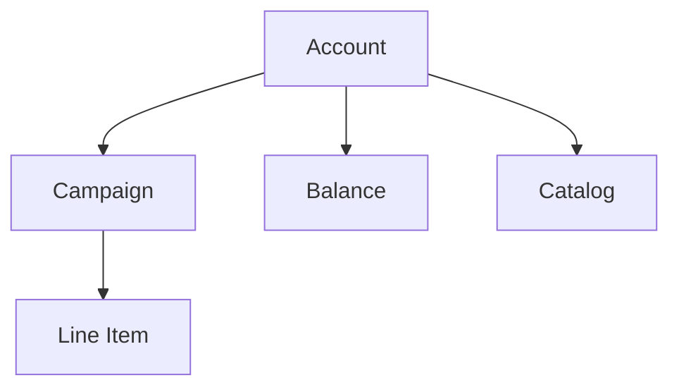

An account is the top-level entity in Commerce Max. Campaigns, balances, and catalogs all belong to an account. Access to an account is granted by Criteo — accounts are not self-created.

<Note>
  [→ API Reference](/retail-media/reference/get-accounts)
</Note>

## Account Types

| Type | Represents | Notes |
|---|---|---|
| **Demand** | A brand or agency running ads | Has read-only access to balances via the API; balance creation is handled through the Billing portal. Two subtypes: **Demand-Brand** (brands managed in Account Settings) and **Demand-Seller** (Seller IDs managed in Account Settings). |
| **Supply** | A retailer managing ad inventory | Has access to both supply and demand sides. Can create and modify balances via the API with the right permissions. |

Private Market is not a separate account type — it refers to a retailer-managed environment within Commerce Max.

## Constraints

- Accounts are created by Criteo under a contractual agreement. Contact your account representative to set one up.
- Each user has access only to the accounts they were explicitly invited to.
- The capabilities available to an account depend on its type and what the retailer has enabled — for example, Retailer Budget campaigns are only available to Demand accounts authorized by the retailer.
- Supply accounts have access to both supply and demand workflows; Demand accounts do not have supply-side access.
