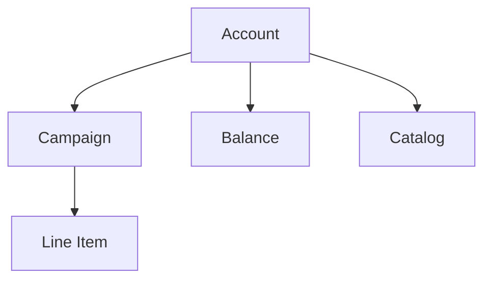

import { InlineImage } from "/snippets/InlineImage.jsx";

A Retail Media Platform (RMP) account is unique, and the Criteo API enables external applications to make calls to the account once API access has been granted. The account endpoints are synchronized with the RMP platform and API, meaning any changes made through the API will be immediately reflected in the RMP account.

**Currently, accounts are created by Criteo. Please contact your account representative if you need an account to be set up.**

The Accounts endpoints will allow you to:

- Check for available retailers you can serve ads on
- Look out for brands available witin your account
- Access your account basic settings

[→ API Reference](/retail-media/reference)

<Note>
  You can learn more about Accounts in our [CMax Help Center](https://help.retailmedia.criteo.com/kb/guide/en/about-accounts-3c39AcNsJx/Steps/969774).
</Note>

---

## Key Attributes

<Info>Coming soon.</Info>

---

## Constraints

<Info>Coming soon.</Info>

---

## What's next

<Card title="Catalogs" icon="arrow-right" href="/retail-media/docs/catalogs">
  Access the products available for promotion in your account catalog.
</Card>

 

