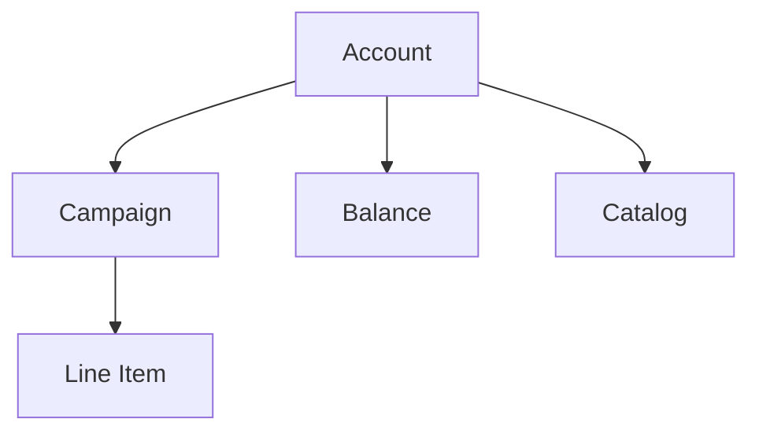

An account is the top-level entity in Commerce Max. Campaigns, balances, and catalogs all belong to an account. Access to an account is granted by Criteo — accounts are not self-created.

<Note>
  See the full list of endpoints and parameters in the [→ API Reference](/retail-media/reference/get-accounts)
</Note>

<Note>
  Learn more in the [CMax Help Center](https://help.retailmedia.criteo.com/kb/guide/en/about-accounts-3c39AcNsJx/Steps/969774)
</Note>

## Account types

| Type | API `type` / `subtype` | Who it represents | What they do |
|---|---|---|---|
| **Retailer** | `supply` | A retailer managing ad inventory | Manages inventory, creates and funds balances, runs campaigns on behalf of vendors. Has access to both supply-side and demand-side features. |
| **Brand** | `demand` / `brand` | A brand running campaigns | Creates campaigns and line items, funds them through balances. Balances are read-only via the API — created through the Billing portal. |
| **Seller** | `demand` / `seller` | A marketplace seller running campaigns | Same as Brand but configured via seller IDs rather than brand IDs. |

Private Market is not a separate account type — it refers to a retailer-controlled campaign environment within Commerce Max.

## Account limits

- Each account is scoped to a set of countries and a single billing currency. Criteo sets both when it creates the account — neither can be changed through the API.
- Accounts are created by Criteo under a contractual agreement — contact your account representative to set one up.
- Each user has access only to the accounts they were explicitly invited to.
- Retailer Budget campaigns are only available to Brand and Seller accounts that have been authorized by the retailer.
