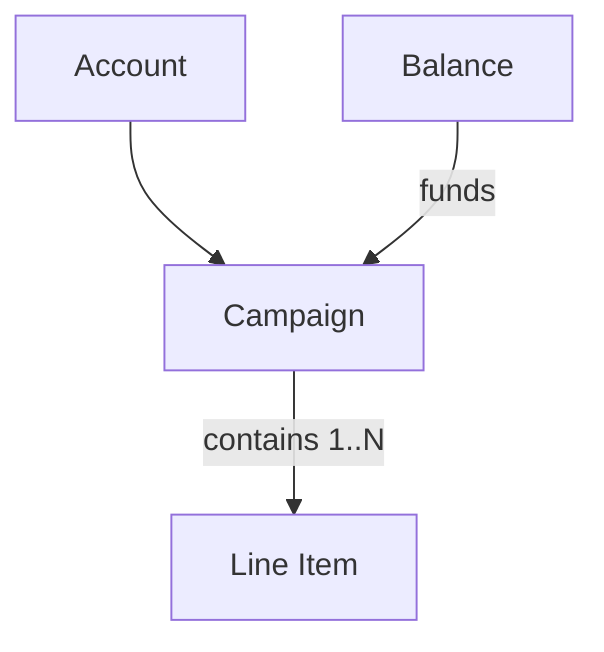

A campaign is the organizational unit that groups line items under a shared marketing objective. It does not deliver ads directly — delivery happens at the line item level. Campaign status reflects the aggregate state of its line items.

[→ API Reference](/retail-media/reference/get-campaigns-by-account-id)

<Info>
  Only Open Auction campaigns are supported via the API. Open Auction operates on a first-price CPC model.
</Info>

## Lifecycle & Statuses

Campaign status is derived from its line items — there is no independent campaign-level delivery switch.

| Status | Meaning |
|---|---|
| **Active** | At least one line item is active and delivering. |
| **Inactive** | All line items are off or inactive. |
| **Scheduled** | The campaign start date (earliest line item start date) is in the future. A campaign can appear Scheduled even if its line items are still Draft or In Review. |
| **Ended** | The end date has passed. Delivery stops; this is an outcome, not a formal persistent status. |

Line items have their own richer status model — see [Line Items](/retail-media/docs/line-items).

## Constraints

- Campaigns must be linked to an active balance to spend. Without one, the line item shows a **No Funds** condition.
- Accounts are capped at **100,000 active campaigns**.
- Campaign budgets are a spend ceiling, not a delivery guarantee. Inventory availability, targeting, and pacing affect how much of the budget is actually spent.
- A small budget overshoot can occur operationally — the delivery engine may place ads briefly after a budget cap is reached. Excess impressions and clicks from those placements can still appear in reporting, which may cause reported CPC to temporarily dip.
- Campaigns can contain line items across multiple brands and retailers.

## What's next

<Card title="Line Items" icon="arrow-right" href="/retail-media/docs/line-items">
  Create line items to select products and retailers, and configure budgets and bids.
</Card>
