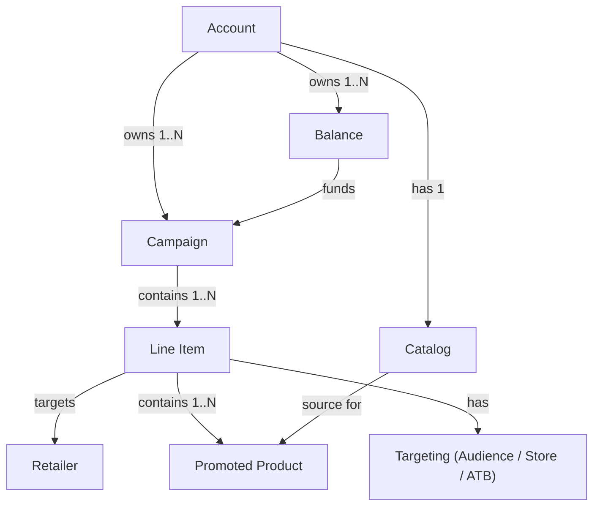

| Object | Role |
|---|---|
| Account | Top-level entity. All campaigns, balances, and catalogs belong to an account. |
| Campaign | Groups line items under a shared marketing objective and attribution window. |
| Balance | Budget object that funds one or more campaigns. Managed by Criteo or the retailer. |
| Line Item | Executes the campaign at a specific retailer. Controls bid, budget, targeting, and promoted products. |
| Promoted Product | A product from the catalog assigned to a line item for promotion. |
| Catalog | The account's product inventory. Source for selecting promoted products. |
| Retailer | The retail platform where ads are served. Each line item targets exactly one retailer. |
| Targeting | Audience segments, store lists, or add-to-basket rules applied to a line item. |
