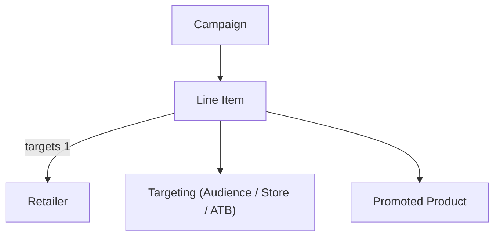

A line item is where ad delivery is configured and controlled. Each line item targets exactly one retailer, holds one or more promoted products, and carries its own bid, budget, and flight date settings.

<Note>
  [→ API Reference](/retail-media/reference/get-line-items-by-campaign-id)
</Note>

## Lifecycle & Statuses

| Status | Meaning |
|---|---|
| **Draft / Incomplete** | Created but required configuration is unfinished or not yet submitted. |
| **In Review** | Submitted to the retailer for approval. Submission cannot be retracted. If an edit requires re-review, the previously approved version continues delivering while the new version is reviewed. |
| **Scheduled** | Fully configured and approved, but start date is in the future. Automatically becomes Active on the start date. |
| **Active** | On and eligible to spend. Active does not guarantee delivery — see Constraints below. |
| **Paused** | Manually switched off. Switching it back on resumes delivery if all other conditions are met. |
| **Ended** | End date reached. Delivery stops. |
| **Budget Hit** | A spend cap was reached — daily (resumes next day) or total (stops permanently). |
| **No Funds** | No active balance is linked to the campaign. Link a balance to resume. |
| **Pending** | Delivery temporarily unavailable — for example, an audience is still aggregating. |
| **Archived** | Inactive for more than 90 days. Cannot be reactivated — duplicate with updated flight dates instead. |

### Onsite Display Auction: retailer review layer

Onsite Display Auction line items have an additional property-level approval status:

- **Fully approved** — all reviewed properties approved; serving with full configuration.
- **Partially approved** — some properties approved, others rejected; serving with approved properties only while rejected ones are corrected.
- **Not active** — all properties rejected; not serving.

Properties subject to retailer review: creatives, products, manual keywords and categories. Recommended keywords and categories are auto-approved.

## Constraints

- Each line item can only target **one retailer**. To advertise across multiple retailers, create separate line items.
- Each line item can hold up to **500 promoted products**.
- Campaigns are limited to **10,000 non-archived line items**.
- Line items are **automatically archived 90 days after their end date**. Archived line items cannot be reactivated.
- **Active ≠ delivering.** A line item can be Active but not serving due to: no linked balance, budget cap reached, no eligible inventory, all products inactive, missing targeting, minimum CPM not met, or audience still aggregating.
- Some fields are locked once a line item is Active — including retailer and start date. Sponsorship line items have additional lock rules (end date, budget).
- Editing a creative in the creative library propagates automatically — if it triggers re-review, it affects all line items sharing that creative.
- A paused but retailer-approved line item still counts as booked inventory.
